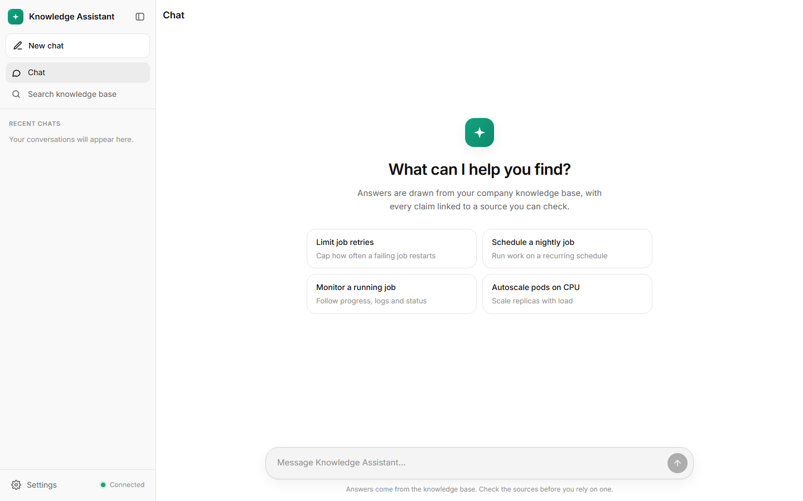
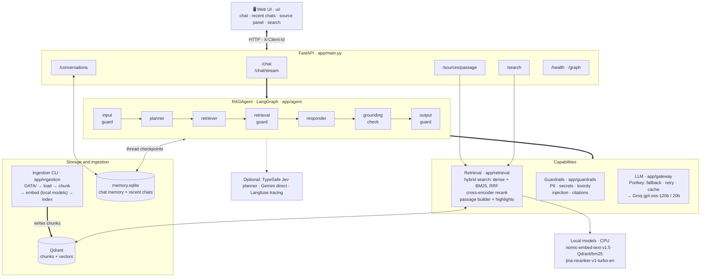
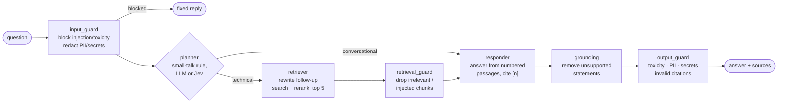
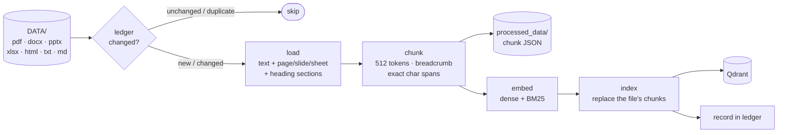
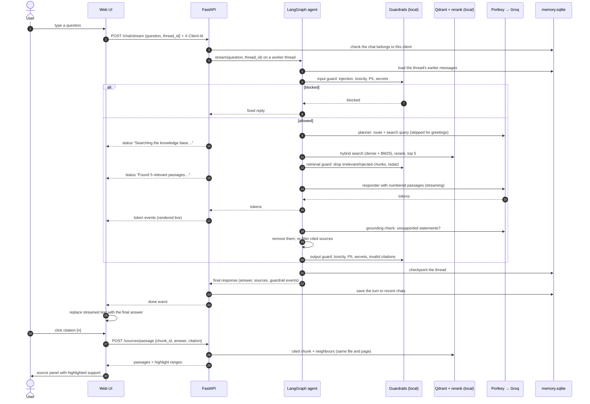

# Enterprise Agentic RAG


A question-answering assistant over your company's documents. It answers technical questions **only from the knowledge base**, cites the passage behind every claim, and lets you open each source with the supporting text highlighted.

It is built as a [LangGraph](https://langchain-ai.github.io/langgraph/) agent behind a FastAPI service, with a ChatGPT-style web UI.

- 🔎 **Hybrid retrieval**: dense embeddings + BM25 keyword search in Qdrant, fused with RRF, then reranked by a local cross-encoder.
- 🧭 **Agentic routing**: a planner decides whether a message needs the knowledge base, and rewrites follow-ups into standalone search queries.
- 📌 **Grounded answers**: numbered citations, a citation check, and a grounding check that removes statements the sources don't support.
- 🛡️ **Guardrails**: prompt-injection, toxicity, PII and secret checks on the input, the retrieved chunks and the answer.
- 💾 **Conversation memory**: chats persist across restarts; recent chats are listed in the sidebar.
- ⚡ **Streaming**: answers stream token by token, with progress updates while the agent searches.
- 📈 **Observability**: optional Langfuse tracing of every step, including token usage.



---

## 📑 Contents

- [Tech stack](#-tech-stack)
- [Architecture](#-architecture)
- [How it works](#-how-it-works)
- [Quick start](#-quick-start)
- [Using the web UI](#-using-the-web-ui)
- [Ingesting documents](#-ingesting-documents)
- [Configuration](#-configuration)
- [API](#-api)
- [Project layout](#-project-layout)
- [Evaluation](#-evaluation)
- [Citations and grounding](#-citations-and-grounding)
- [Data stored on disk](#-data-stored-on-disk)
- [Troubleshooting](#-troubleshooting)

---

## 🧰 Tech stack

| Layer | Technology | Used for |
|---|---|---|
| **Language & tooling** | Python 3.13, [uv](https://docs.astral.sh/uv/) | Runtime, dependency and environment management |
| **Agent orchestration** | [LangGraph](https://langchain-ai.github.io/langgraph/), [LangChain](https://python.langchain.com/) | The agent graph (nodes, routing, streaming), prompts, retriever and chat-model interfaces |
| **LLM access** | [Portkey](https://portkey.ai) AI gateway → [Groq](https://groq.com) (`openai/gpt-oss-120b`, fallback `gpt-oss-20b`); [Google Gemini](https://ai.google.dev) as an alternative | Planner, query rewriting, answers, grounding check; gateway handles fallback, retries and response caching |
| **Routing (optional)** | [TypeSafe Jev](https://docs.typesafe.ai) | Fast typed technical/conversational decision with calibrated confidence |
| **Vector database** | [Qdrant](https://qdrant.tech) (Cloud/server, or embedded on disk) | Dense + sparse vectors and chunk payloads; hybrid search with RRF fusion |
| **Embeddings** | [FastEmbed](https://github.com/qdrant/fastembed): `nomic-ai/nomic-embed-text-v1.5` (dense), `Qdrant/bm25` (sparse); Gemini embeddings optional | Semantic and keyword search, run locally on CPU |
| **Reranking** | FastEmbed cross-encoder `jinaai/jina-reranker-v1-turbo-en` | Reordering search candidates by relevance, locally |
| **Document parsing** | PyMuPDF4LLM (PDF → Markdown), python-docx, python-pptx, openpyxl, BeautifulSoup, charset-normalizer | Loading PDF, Word, PowerPoint, Excel, HTML and text files |
| **Chunking** | LangChain text splitters, tiktoken | Heading-aware, token-sized chunks with exact source spans |
| **Guardrails** | [Guardrails AI](https://www.guardrailsai.com) validators: Detect PII ([Presidio](https://microsoft.github.io/presidio/) + spaCy `en_core_web_lg`), Toxic Language (Detoxify), Secrets Present, Detect Jailbreak (optional); custom injection and citation validators | Input, retrieval and output safety checks, run locally (PyTorch, Transformers) |
| **API** | [FastAPI](https://fastapi.tiangolo.com), Uvicorn, Pydantic | REST + NDJSON streaming endpoints, request validation, OpenAPI docs |
| **Configuration** | pydantic-settings | Typed settings from environment variables / `.env` |
| **Persistence** | SQLite: LangGraph `SqliteSaver` checkpointer, conversation store, ingestion ledger | Conversation memory, recent chats, incremental ingestion |
| **Web UI** | Plain HTML, CSS and JavaScript (no framework, no build step) | ChatGPT-style chat, streaming, recent chats, source viewer |
| **Observability** | [Langfuse](https://langfuse.com) (optional), Python logging (text or JSON, rotating files) | Traces of every agent step with token usage; application logs |

---

## 🧱 Architecture

### 📐 System overview

Two paths share the Qdrant index: **ingestion** (offline, CLI) writes chunks into it, and the **chat path** (FastAPI + LangGraph agent) searches it. Embeddings, BM25, reranking and guardrail validators run locally on CPU; the LLM is reached through the Portkey gateway (or Gemini directly).



### 🤖 Agent pipeline



### 🔄 Ingestion pipeline



### 📡 Request flow: one streamed question



---

## 🧩 How it works

The graph is drawn under [Agent pipeline](#-agent-pipeline); each step:

| Step | What it does |
|---|---|
| **input_guard** | Blocks prompt injection and toxic input; redacts PII and secrets before any model sees them. |
| **planner** | Routes the message: *technical* (needs the knowledge base) or *conversational* (greetings, small talk). Plain greetings are matched by a rule without a model call. The LLM planner also writes the search query; the Jev planner (TypeSafe) only routes. |
| **retriever** | Rewrites follow-ups into a standalone query using the conversation, runs hybrid search, reranks, and returns the top chunks. |
| **retrieval_guard** | Drops low-relevance chunks and chunks containing injected instructions; redacts PII and secrets in chunk text. |
| **responder** | Writes the answer from the numbered passages only, citing them as `[1]`, `[2]`… |
| **grounding** | A second LLM pass that lists statements the passages don't support and removes them. |
| **output_guard** | Blocks toxic answers, redacts PII/secrets, removes citations to sources that don't exist. |

Each conversation is a LangGraph thread checkpointed to SQLite, so follow-up questions keep their context, even after a restart.

---

## 🚀 Quick start

### ✅ Prerequisites

- **Python 3.13+** and [**uv**](https://docs.astral.sh/uv/)
- **Qdrant**: a server or Qdrant Cloud (`QDRANT_URL`), or nothing at all — without `QDRANT_URL` an embedded on-disk store is used
- **An LLM**: a Google Gemini API key, or a [Portkey](https://portkey.ai) gateway key with a provider (e.g. Groq) in its Model Catalog
- Optional: a TypeSafe API key (Jev planner), Langfuse keys (tracing)

Embeddings (`nomic-embed-text-v1.5`), BM25 and the reranker run locally on CPU; their models are downloaded once to `.cache/fastembed`.

### 1. Install

```bash
uv sync
```

### 2. Configure

Copy the template and fill in the keys you need:

```bash
cp .env.example .env
```

`.env.example` lists every setting with its default. A minimal setup with Gemini and embedded Qdrant:

```ini
LLM_PROVIDER=gemini
GOOGLE_API_KEY=...
LLM_MODEL=gemini-3.5-flash
PLANNER_PROVIDER=llm          # or "jev" with TYPESAFE_API_KEY
QDRANT_COLLECTION=enterprise_docs
```

Or through Portkey, with a saved gateway config (fallbacks, retries, caching):

```ini
LLM_PROVIDER=portkey
PORTKEY_API_KEY=...
PORTKEY_CONFIG=pc-xxxxxxxx              # saved config id
LLM_MODEL=@groq/openai/gpt-oss-120b     # Model Catalog slug
LLM_TEMPERATURE=0
QDRANT_URL=https://<cluster>.qdrant.io:6333
QDRANT_API_KEY=...
QDRANT_COLLECTION=enterprise_agentic_rag
QDRANT_TIMEOUT=300
```

See [Configuration](#-configuration) for every setting. `.env` is git-ignored; never commit it.

### 3. Ingest documents

Put files under `DATA/` (subfolders become the chunk's `source_type`, e.g. `DATA/true_data`), then:

```bash
uv run python -m app.ingestion.ingestion --data-dir DATA/true_data
```

### 4. Run

```bash
uv run uvicorn app.main:app --port 9000 --reload
```

Open **http://127.0.0.1:9000/** for the UI and **http://127.0.0.1:9000/docs** for the interactive API docs.

> Use `127.0.0.1`, not `0.0.0.0`: with `--host 0.0.0.0` Uvicorn prints the bind address, which browsers can't open. From another machine, use this machine's IP or hostname.

You can also chat from the terminal:

```bash
uv run python -m app.agent.graph                              # interactive, multi-turn
uv run python -m app.agent.graph -q "How do I autoscale pods?"
uv run python -m app.agent.graph --diagram                    # the graph as Mermaid
```

---

## 💻 Using the web UI

The UI (`ui/index.html`, `ui/static/`) is a single page with no build step.

**Left sidebar**
- **New chat**, and **Chat / Search knowledge base** modes.
- **Recent chats**, grouped by Today / Yesterday / Previous 7 days / Previous 30 days / month. Click to reopen a chat exactly as it was answered; hover for **rename** and **delete** (deleting also erases the assistant's memory of that chat).
- **Settings** (collapsible): search filters, light/dark/auto theme, and system information (model, planner, retrieval mode, collection, guardrails).

**Chat**
- Answers stream in as they are written, with progress such as *Searching the knowledge base…*.
- Each answer shows its route (`technical` / `conversational` / `blocked`), the search query used, the time taken, any guardrail actions, and its sources.
- **Click a citation `[n]` or a source** to open it in the right-hand panel: the cited passage with its section path, the passages around it, and the sentences the answer drew on **highlighted**.

**Search mode** runs retrieval only (no LLM), to inspect which passages the assistant would receive.

There are no user accounts: each browser gets a random id and sees only its own chats. Clearing site data, or switching browser or device, starts an empty chat list.

---

## 📥 Ingesting documents

```bash
uv run python -m app.ingestion.ingestion                       # everything under DATA/
uv run python -m app.ingestion.ingestion --data-dir DATA/true_data
uv run python -m app.ingestion.ingestion --dry-run             # parse + chunk + save JSON only
uv run python -m app.ingestion.ingestion --force               # re-ingest unchanged files too
uv run python -m app.ingestion.ingestion --no-prune            # keep entries of removed files
```

Pipeline: **load → chunk → save JSON (`processed_data/`) → embed → index in Qdrant**.

**Supported formats**

| Format | Loader | Location recorded | Sections |
|---|---|---|---|
| PDF | PyMuPDF4LLM (Markdown output) | page | Markdown headings |
| Word `.docx` | python-docx (paragraphs + tables) | — | Title / Heading N styles |
| PowerPoint `.pptx` | python-pptx | slide | — |
| Excel `.xlsx`, `.xlsm` | openpyxl (rows as `header: value`) | sheet | — |
| HTML `.html`, `.htm` | BeautifulSoup (scripts, nav, footers removed) | — | `<h1>`–`<h6>` |
| Text `.txt`, `.rst`, `.log`; Markdown `.md`, `.markdown` | plain text | — | Markdown headings (`.md`, `.markdown`) |

**Chunking** (512 tokens, 64 overlap by default): sections are split on headings first, then by size. Each chunk records its heading path (`h1` › `h2` › `h3`), starts with it as a breadcrumb line, and stores its exact character span (`start_index`, `end_index`) in the source text. Code blocks are kept verbatim and `#` comments inside them are not treated as headings.

**Incremental runs**: an ingestion ledger (`processed_data/ingestion_ledger.db`) stores each file's content hash. Unchanged files and byte-identical copies are skipped; files deleted or moved out of `--data-dir` are pruned from the index. Re-ingesting a file replaces all of its chunks.

> Changing `EMBEDDING_PROVIDER`, `EMBEDDING_MODEL` or `RETRIEVAL_MODE` changes the stored vectors: use a new `QDRANT_COLLECTION` and re-ingest. Retrieval refuses to run against a collection built with a different model.

---

## 🔧 Configuration

All settings are read from environment variables or `.env` (`app/config/config.py`). A key left empty in `.env` (e.g. `RETRIEVAL_TOP_K=`) uses the default.

### 🧠 LLM

| Setting | Default | Notes |
|---|---|---|
| `LLM_PROVIDER` | `gemini` | `gemini` (direct, `GOOGLE_API_KEY`) or `portkey` (`PORTKEY_API_KEY`) |
| `LLM_MODEL` | `gemini-3.5-flash` | With Portkey: a Model Catalog slug, e.g. `@groq/openai/gpt-oss-120b` |
| `PLANNER_MODEL` | same as `LLM_MODEL` | A separate, cheaper model for the planner |
| `LLM_TEMPERATURE` | model default | `0` gives the most consistent answers |
| `LLM_TIMEOUT`, `LLM_MAX_RETRIES` | `60`, `2` | |
| `PORTKEY_BASE_URL` | `https://api.portkey.ai/v1` | |
| `PORTKEY_CONFIG` | — | Saved config id (`pc-…`) or inline JSON |
| `GROQ_SLUG`, `GROQ_SLUG_2` | — | Built-in Groq fallback config (120B → 20B) when `PORTKEY_CONFIG` is empty. Inline configs are rejected by workspaces with *block inline config* enabled: use a saved config instead. |

### 🧭 Planner and agent

| Setting | Default | Notes |
|---|---|---|
| `PLANNER_PROVIDER` | `jev` | `jev` (TypeSafe, needs `TYPESAFE_API_KEY`) or `llm` |
| `PLANNER_MIN_CONFIDENCE` | `0.6` | Below this, Jev's decision falls back to *technical* |
| `AGENT_HISTORY_MESSAGES` | `6` | Earlier messages the agent sees, for follow-ups |
| `MEMORY_DB_PATH` | `memory_data/memory.sqlite` | Conversation memory and recent chats |

### 🔎 Retrieval

| Setting | Default | Notes |
|---|---|---|
| `QDRANT_URL`, `QDRANT_API_KEY` | — | Without a URL, an embedded store at `QDRANT_PATH` (`qdrant_data/`) |
| `QDRANT_COLLECTION` | `enterprise_docs` | |
| `QDRANT_TIMEOUT` | `60` | Raise it (e.g. `300`) if ingestion hits write timeouts |
| `RETRIEVAL_MODE` | `hybrid` | `hybrid` (dense + BM25) or `dense` |
| `RETRIEVAL_TOP_K`, `RETRIEVAL_FETCH_K` | `5`, `20` | Chunks returned / candidates reranked |
| `RERANK_ENABLED`, `RERANK_MODEL` | `true`, `jinaai/jina-reranker-v1-turbo-en` | |
| `EMBEDDING_PROVIDER`, `EMBEDDING_MODEL` | `fastembed`, `nomic-ai/nomic-embed-text-v1.5` | `gemini` embeddings also supported |
| `CHUNK_SIZE`, `CHUNK_OVERLAP` | `512`, `64` | Tokens |

### 🔒 Guardrails and grounding

| Setting | Default | Notes |
|---|---|---|
| `GUARDRAILS_ENABLED` | `true` | Input, retrieval and output guards |
| `GROUNDING_CHECK_ENABLED` | `true` | Removes unsupported statements from technical answers (one extra LLM call per answer) |
| `RETRIEVAL_MIN_RERANK_SCORE` | `-2.0` | Chunks below it are dropped as irrelevant (calibrated on `true_data`) |
| `GUARDRAILS_PII_ENTITIES` | email, phone, credit card, US SSN, IBAN | Names and IPs are left out on purpose |
| `GUARDRAILS_TOXICITY_THRESHOLD` | `0.5` | |
| `GUARDRAILS_INJECTION_PATTERNS` | `true` | Rule-based injection check |
| `GUARDRAILS_JAILBREAK_MODEL` | `false` | ML jailbreak detector; off by default (it scored attacks and benign prompts alike on this data) |

### 📝 Logging and tracing

| Setting | Default | Notes |
|---|---|---|
| `LOG_LEVEL`, `LOG_FORMAT` | `INFO`, `text` | `json` for log aggregators |
| `LOG_TO_FILE`, `LOG_DIR` | `true`, `logs/` | Rotating `app.log` and `error.log` |
| `LANGFUSE_PUBLIC_KEY`, `LANGFUSE_SECRET_KEY` | — | Tracing is on only when both are set |
| `LANGFUSE_BASE_URL`, `LANGFUSE_ENVIRONMENT` | `https://cloud.langfuse.com`, `development` | |

---

## 🔌 API

Interactive docs at `/docs`.

| Method | Path | Purpose |
|---|---|---|
| `POST` | `/chat` | Ask a question; send `thread_id` back to continue the conversation |
| `POST` | `/chat/stream` | Same, streamed as NDJSON events |
| `GET` | `/conversations` | Recent chats of this client, newest first |
| `GET` | `/conversations/{id}` | One chat with all its turns |
| `PATCH` | `/conversations/{id}` | Rename a chat |
| `DELETE` | `/conversations/{id}` | Delete a chat and the agent's memory of it |
| `POST` | `/sources/passage` | A cited chunk with its neighbours, and the ranges the answer drew on |
| `POST` | `/search` | Retrieval only (hybrid search + rerank), for debugging |
| `GET` | `/health` | Liveness and configuration summary (including the model actually used) |
| `GET` | `/graph` | The agent graph as Mermaid |
| `GET` | `/evaluations` | Evaluation runs (reports from `evaluation/run_eval.py`), newest first |
| `GET` | `/evaluations/{run_id}` | One evaluation run's full report |

Conversation endpoints and `/chat` use the `X-Client-Id` header to keep each client's chats separate (the UI sends a random id per browser). This is not authentication.

**Ask a question**

```bash
curl -s http://127.0.0.1:9000/chat -H "Content-Type: application/json" \
  -d '{"question": "How do I limit how many times a Kubernetes job retries?"}'
```

The response contains `answer`, `route`, `search_query`, `sources` (number, file, location, section, chunk_id, rerank score), `thread_id`, `guardrails` events, the processed `question` and `duration_seconds`.

**Stream an answer**: `POST /chat/stream` with the same body returns one JSON object per line:

```json
{"type": "status", "text": "Searching the knowledge base…"}
{"type": "token", "text": "Set the "}
{"type": "done", "response": { "...": "same as /chat" }}
```

Show `response.answer` from the `done` event as the final text: the grounding check and output guardrails may have changed what was streamed. Errors arrive as `{"type": "error", "detail": ...}`.

---

## 📂 Project layout

```
app/
├── main.py                 FastAPI app: API endpoints and the web UI
├── config/                 Settings (env / .env)
├── agent/
│   ├── graph.py            LangGraph assembly, RAGAgent (ask / stream), CLI
│   ├── nodes.py            Planner, retriever, responder, grounding and guard nodes
│   ├── prompts.py          All prompts and fixed answers
│   ├── llm.py              Chat model construction and retry policy
│   ├── jev.py              TypeSafe Jev client (planner)
│   └── state.py            Graph state
├── retrieval/
│   ├── retriever.py        Hybrid search, de-duplication, reranking (also a CLI)
│   └── passage.py          Source viewer: passage in context + highlighting
├── ingestion/
│   ├── ingestion.py        Ingestion pipeline and CLI
│   ├── ledger.py           Content-hash ledger (skip / dedupe / prune)
│   ├── loaders/            PDF, Office, HTML and text loaders
│   ├── chunking/           Heading-aware, span-recording splitters
│   └── embeddings/         Dense (fastembed / Gemini) and BM25 embeddings
├── guardrails/             Guardrails AI validators and the input/retrieval/output guards
├── gateway/                Portkey gateway client and configs
├── memory/                 SQLite conversation memory and recent-chats store
├── observability/          Langfuse tracing wrapper
└── logging/                Logging setup
ui/
├── index.html              Web UI
└── static/                 app.js, styles.css
evaluation/                 deepeval evaluation: golden dataset, metrics, runner (see evaluation/README.md)
DATA/                       Source documents (git-ignored, except one sample per file type)
```

Retrieval can be tried on its own:

```bash
uv run python -m app.retrieval.retriever "How do I autoscale pods?"
uv run python -m app.retrieval.retriever "cron schedule syntax" -k 3 --source-type true_data
uv run python -m app.retrieval.retriever "kubectl rollout undo" --mode dense --no-rerank
```

---

## 🧪 Evaluation

`evaluation/` (outside the app) evaluates the agent with [deepeval](https://deepeval.com) on a golden dataset over `DATA/true_data`. It scores retrieval (contextual precision, recall, relevancy, source hit), answers (relevancy, faithfulness, correctness), abstention on out-of-scope questions, routing and guardrail blocking.

```bash
uv sync --group eval
uv run --group eval python -m evaluation.run_eval            # writes evaluation/results/<timestamp>/
uv run --group eval --env-file evaluation/deepeval.env deepeval test run evaluation/test_rag.py  # same, as pytest tests
```

Results appear in the web UI under **Evaluation** in the sidebar: pass rate, a score bar per metric against its threshold, and every case with its answer, reference answer, retrieved sources and the judge's reasons (read-only, from `GET /evaluations`). The judge uses the app's own LLM settings by default. See [evaluation/README.md](evaluation/README.md) for the metrics, the judge and the dataset format.

---

## 📚 Citations and grounding

1. Retrieved chunks are numbered `[1]`…`[N]` and given to the responder with their file, location and section.
2. The responder must use only those passages and cite each statement. Native model citation styles such as `【1】` are normalised to `[1]`.
3. Only sources the answer actually cites are returned (all of them if it cites none).
4. The **grounding check** removes sentences that add specific facts the passages don't state or imply, such as a default value the documents never mention. Code blocks are left as written. Each removal appears as an *unsupported claim dropped* guardrail event.
5. The **citation check** removes citations to sources that don't exist (e.g. `[7]` when there were 5).
6. In the UI, each `[n]` opens the source panel, which highlights the passage sentences sharing distinctive words with the answer sentences citing it.

Limits: highlighting matches wording, not meaning; the grounding check is an LLM judgement and can occasionally be too strict; and re-ingesting a changed document gives its chunks new ids, so older chats may show *Source not found* for those sources.

---

## 💽 Data stored on disk

| Path | Contents | Safe to delete? |
|---|---|---|
| `memory_data/memory.sqlite` | Conversation memory and recent chats | Yes: erases all chats |
| `processed_data/` | Parsed chunks as JSON, ingestion ledger | Yes: the next ingestion re-processes everything |
| `qdrant_data/` | Embedded Qdrant store (when `QDRANT_URL` is not set) | Yes: re-ingest afterwards |
| `.cache/fastembed/` | Downloaded embedding and reranker models | Yes: downloaded again on next start |
| `logs/` | Application logs | Yes |
| `evaluation/results/` | Evaluation runs (agent outputs, deepeval reports) shown in the UI's Evaluation view | Yes: removes them from the Evaluation view |

All of these are git-ignored.

---

## 🩺 Troubleshooting

| Symptom | Cause and fix |
|---|---|
| UI shows unstyled HTML | Open the page through the server (`http://127.0.0.1:9000/`), not as a file, and hard-refresh (Ctrl+F5) after moving files. |
| Sidebar says *API unavailable* | The page was opened from disk, or the server isn't running. |
| *Couldn't reach the language model because of a configuration problem* | See the server log. With Portkey: `Invalid API Key` usually means the wrong `PORTKEY_BASE_URL`; `inline_config_blocked` means the workspace requires a saved config (`PORTKEY_CONFIG=pc-…`); `model_not_found` means the provider retired the model in your config. |
| *Language model is temporarily unavailable* | Rate limit or overload (429/503) after retries; try again shortly. |
| *Index required but not found* from Qdrant | A filter on an unindexed payload field. Only `metadata.source`, `metadata.file_type` and `metadata.source_type` are indexed. |
| Ingestion fails with *write operation timed out* | Raise `QDRANT_TIMEOUT` (e.g. `300`) and run again; already-ingested files are skipped. |
| Same question gives different answers | Asking again in the **same chat** sends the earlier turns too, so the search query and answer change. In a new chat, repeated identical questions are answered consistently (Portkey cache, `LLM_TEMPERATURE=0`). |
| Changes to `.env` not picked up | `--reload` only watches code: restart the server. |
