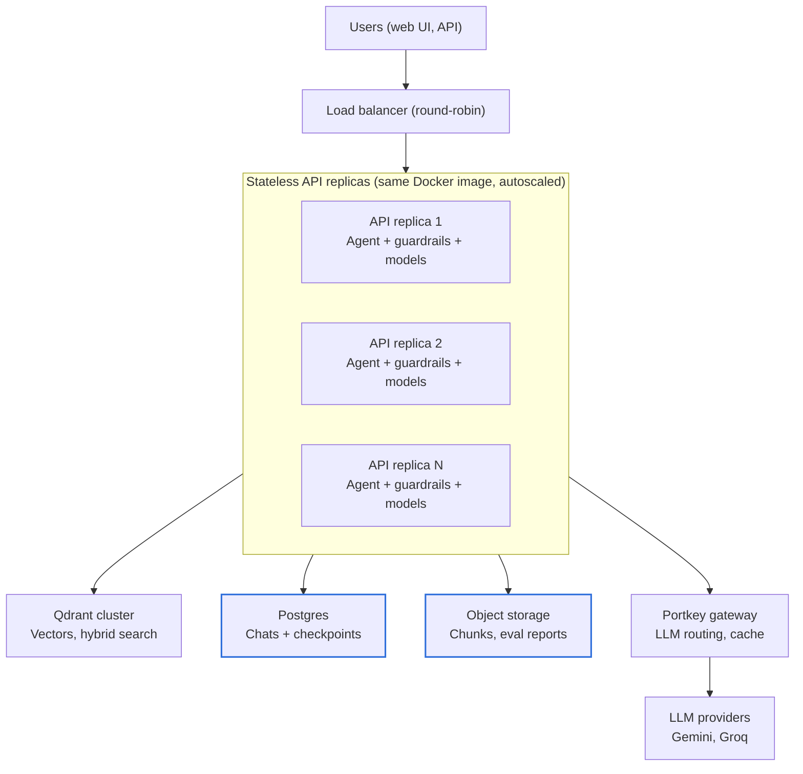

# Enterprise Agentic RAG — Scaling Plan

As of 2026-10-09.

## Summary

Today the app runs as one process on one machine, and with the default embedded Qdrant it answers one request at a time. Vertical scaling (a bigger machine) helps only after that lock is removed. Horizontal scaling (more replicas) needs the local SQLite and file state moved to shared services first.

Recommended order:

1. Point the app at a Qdrant server (`QDRANT_URL`). This is a configuration change and removes the global request lock.
2. Move conversation memory and the recent-chats list from SQLite to Postgres. This makes the API stateless.
3. Run several replicas of the existing Docker image behind a load balancer, and size each replica vertically for its in-process models.
4. Raise LLM throughput through the Portkey gateway (load balancing, fallbacks, caching). At volume, the LLM provider's rate limits are the real ceiling, not our servers.
5. Later, move embedding and reranking into a separate inference service, so API replicas stay small and cheap to add.

## Current architecture and bottlenecks

Everything except the LLM providers runs inside one FastAPI process. A chat request goes through the input guardrails, the planner (Jev or an LLM), hybrid retrieval in Qdrant, a local cross-encoder rerank, the responder LLM, a grounding-check LLM pass and the output guardrails. Conversation state is checkpointed to a local SQLite file.

| Bottleneck | Where in the code | Effect at scale | Fix |
| --- | --- | --- | --- |
| Global request lock with embedded Qdrant | `app/main.py`, `agent_lock` when `QDRANT_URL` is unset | One chat, search or passage request at a time; others queue behind multi-second LLM calls | Set `QDRANT_URL` to a Qdrant server |
| Local SQLite state | `app/memory/store.py` (LangGraph checkpoints + recent chats), `processed_data/ingestion_ledger.db` | A second replica or worker sees different conversations; can't scale out | Postgres (`langgraph-checkpoint-postgres`) |
| Local files | `processed_data/`, `evaluation/results/`, `logs/` | Not shared between replicas; lost with the container | Object storage (S3); logs to stdout |
| In-process models | Embedding (nomic-embed-text-v1.5), BM25, reranker (jina-reranker-v1-turbo-en), spaCy `en_core_web_lg`, guardrail validators | Every replica pays the model RAM and loads them at startup; CPU-bound per request | Size replicas for RAM; later, a separate inference service |
| LLM calls per turn | Planner (LLM mode), responder, grounding check | Provider rate limits and latency cap throughput long before CPU does | Portkey load balancing, fallbacks, caching; Jev planner |
| Unbounded streaming threads | `/chat/stream` starts a thread per request | No back-pressure under a burst | Concurrency limit per replica |
| No authentication | `X-Client-Id` header is a random browser id | No per-user rate limits or quotas | SSO/OIDC + rate limiting at the gateway |
| Sequential ingestion | `DocumentProcessor._run` processes files one by one | Slow for large or frequently changing corpora | Job queue with parallel workers |

## Vertical scaling

Vertical scaling means giving one replica more CPU and RAM. It is the quickest win once the Qdrant lock is gone, but it stops paying off at a few concurrent requests per process, because most of a request's time is spent waiting on LLM calls.

**What more resources buy**

- **RAM** decides how many worker processes fit on a machine. Each process loads every local model, so RAM, not CPU, is usually the first limit. Measure the resident memory of one warmed-up process before sizing; a rough planning figure is 1.5–3 GB per process (approximate, not yet measured).
- **CPU** speeds up the per-request local work: query embedding, BM25, reranking 20 candidates, and the PII and toxicity guardrails. These run on ONNX Runtime or PyTorch and use several cores each.
- **GPU** is not needed at current volumes. It becomes worth it only if reranking or the guardrail models dominate latency under load.

**Tuning knobs that already exist**

| Setting | Default | Effect |
| --- | --- | --- |
| `EMBEDDING_THREADS` | library default | Threads for FastEmbed embedding and reranking; set to cores ÷ workers to avoid oversubscription |
| Uvicorn `--workers` | 1 | Processes per container; each loads all models. Needs Postgres state first (SQLite per worker diverges) |
| `RETRIEVAL_FETCH_K` | 20 | Candidates reranked per query; lower cuts CPU per request at some cost to recall |
| `RERANK_ENABLED` | true | Turning it off removes the heaviest CPU step, at a quality cost |
| `GROUNDING_CHECK_ENABLED` | true | Removes one LLM call per technical answer, at a quality cost |
| `GUARDRAILS_JAILBREAK_MODEL` | false | Keep off: it adds a PyTorch model and ~4 s load for no measured signal |

**Limits.** One machine is a single point of failure, and LLM provider rate limits don't grow with machine size. Use vertical scaling to find the right replica size, then scale out.

## Horizontal scaling

Horizontal scaling means running N identical API replicas behind a load balancer. It is the long-term path, and it works as soon as no replica keeps state that another replica needs.



Replicas hold only models and code; every piece of state sits in a shared service, so the load balancer can send any request anywhere. Postgres and object storage (highlighted) are the new shared stores that replace local SQLite and files.

**Prerequisites**

1. Qdrant runs as a server or cluster (`QDRANT_URL`), shared by all replicas.
2. Conversation memory (LangGraph checkpoints) and the recent-chats tables live in Postgres.
3. Parsed chunks, the ingestion ledger and evaluation reports live in shared storage (Postgres and S3), not on local disk.
4. Logs go to stdout as JSON (`LOG_TO_FILE=false`, `LOG_FORMAT=json`), which the Docker image already sets in part.

**Load balancer.** Round-robin is enough: once state is in Postgres, any replica can continue any conversation, so no sticky sessions are needed. `/chat/stream` returns NDJSON over one long HTTP response, so set idle timeouts above the slowest answer (at least 120 s) and turn off response buffering; the API already sends `X-Accel-Buffering: no`.

**Health and startup.** Startup loads several models, so replicas need a readiness check on `/health` with a long start period (the Docker image allows 120 s). Bake models into the image, as the Dockerfile does, so new replicas don't download them.

**Autoscaling signals**

| Signal | Why | Scale out when |
| --- | --- | --- |
| In-flight requests per replica | Requests are mostly I/O wait on LLMs; CPU understates load | Above the tested per-replica concurrency |
| p95 `/chat` latency | What users feel | Rising while LLM latency is flat |
| CPU | Reranking and guardrails are CPU-bound | Sustained above 70% |
| Memory | Models are resident | Never scale on it; size for it |

Adding replicas does not raise the LLM provider's rate limits. Past a certain size, more replicas only produce more 429 errors; the component plan covers that.

## Component plan

Each component scales differently; the table gives the vertical and horizontal option for each.

| Component | Today | Vertical | Horizontal |
| --- | --- | --- | --- |
| API (FastAPI + LangGraph agent) | One Uvicorn process; sync endpoints in a thread pool | More cores and RAM; tune `EMBEDDING_THREADS` | Stateless replicas behind a load balancer, after state moves out |
| Vector store (Qdrant) | Embedded on-disk store, or a server via `QDRANT_URL` | Larger Qdrant node; keep vectors and payload index in RAM | Qdrant cluster: shards for corpus size, replicas for query throughput |
| Conversation memory | SQLite file (`MEMORY_DB_PATH`) | — | Postgres via `langgraph-checkpoint-postgres`; managed instance with a read replica if needed |
| Embedding, BM25, rerank | FastEmbed in every API process | More CPU per replica | Separate inference service (e.g. Hugging Face TEI) or Qdrant server-side inference, scaled on its own |
| Guardrails (Presidio, toxicity) | In every API process | More CPU per replica | Same inference service, or a guardrail sidecar |
| LLM calls | Gemini direct, or Portkey with Groq fallbacks | — (provider-side) | Portkey load balancing across keys and providers, semantic cache, paid tiers with higher quotas |
| Ingestion | CLI, one file at a time | More CPU for parsing and embedding | Queue (e.g. SQS or Redis) + N workers; batched upserts; ledger in Postgres |
| Parsed chunks, eval reports | Local folders | — | S3 or another object store |
| Observability | Langfuse tracing, logs to files or stdout | — | JSON logs to a central sink; lower `LANGFUSE_SAMPLE_RATE` at high volume |

Two notes on the vector store. Changing the embedding model or `RETRIEVAL_MODE` needs a new collection and a re-ingest, so plan cluster sizing per collection. Hybrid mode stores both dense and BM25 sparse vectors, so it needs more memory than dense-only.

## Capacity planning

No load test has been run yet, so replica counts can't be set from data. Take these measurements on one replica with a Qdrant server first, then size from them.

- [ ] Resident memory of one warmed-up API process (all models loaded)
- [ ] p50 and p95 latency per stage: guardrails, planner, retrieval, rerank, responder, grounding check (Langfuse traces already break this down)
- [ ] Maximum concurrent `/chat` requests per replica before p95 latency rises more than 20%
- [ ] LLM requests per minute per answered question, and the provider's quota for each model
- [ ] Ingestion throughput in chunks per minute, and Qdrant memory per million chunks in hybrid mode

Then size with:

```
replicas                  = ceil(peak concurrent chats / tested concurrency per replica) + 1
max questions per minute  = LLM quota (requests/min) / LLM calls per question
```

The extra replica covers a failure or a rolling deploy. The second formula is the ceiling that more replicas can't raise; for example, a quota of 60 requests per minute with 3 LLM calls per question caps the system at 20 questions per minute, however many replicas run.

## Roadmap

Each phase is usable on its own, and each one's exit check gates the next.

| Phase | Change | Type | Effort | Gain | Exit check |
| --- | --- | --- | --- | --- | --- |
| 1 | Qdrant server via `QDRANT_URL` | Vertical | Configuration only | Requests run concurrently | Two chats in parallel finish in about the time of one |
| 2 | Measure one replica (capacity checklist) | Vertical | Small | Real sizing numbers | Memory, latency and concurrency recorded |
| 3 | Postgres for checkpoints and recent chats | Horizontal | Small: `app/memory/store.py` | API becomes stateless | A conversation continues on a different replica |
| 4 | Shared storage for chunks, ledger, eval reports | Horizontal | Small to medium | No local disk state | Replica restarted with an empty disk loses nothing |
| 5 | N replicas behind a load balancer, autoscaled | Horizontal | Medium | Throughput and failover | Load test at target peak with p95 within goal |
| 6 | Portkey load balancing and caching | Horizontal (LLM) | Configuration plus tuning | Higher LLM ceiling, lower cost | 429 rate under 1% at target peak |
| 7 | Authentication and per-user rate limits | Enabler | Medium | Safe multi-user access | Requests tied to real users |
| 8 | Separate inference service; queued ingestion | Both | Large | Small API replicas; large corpora | API replica memory under 1 GB |

## Risks and open questions

- **LLM quotas are the hard ceiling.** Free-tier Gemini quotas are per model and small; production traffic needs paid tiers or several providers behind Portkey.
- **Cost grows per question, not per server.** Three LLM calls per technical answer triple token spend; the grounding check is the first candidate to make optional per request.
- **Model changes force re-ingestion.** A new embedding model or retrieval mode needs a new Qdrant collection, so a large corpus needs a planned, parallel re-index.
- **Image size slows scale-out.** The lockfile pulls CUDA PyTorch on Linux, making the image several GB; a CPU-only torch build would make new replicas start faster.
- Open question: what peak load are we sizing for (users, concurrent chats, questions per minute)?
- Open question: which platform will run it (Kubernetes, ECS, a single VM with Docker Compose)?
